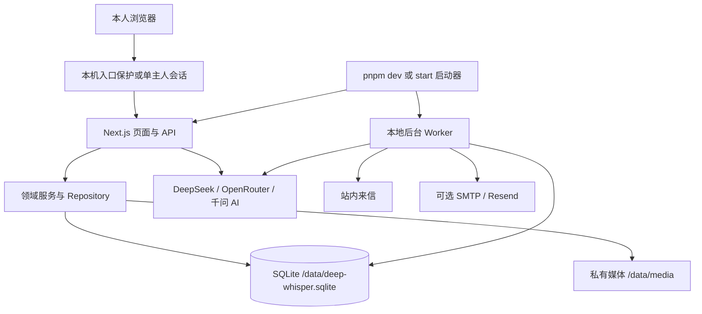

# Deep Whisper Personal 架构

状态：已批准，实施中；实现与审查记录见 implementation/。

## 1. 部署模型

一个安装实例、一位主人、多个伴侣与会话。默认绑定 `127.0.0.1:5000`，没有注册、邮件验证或 OAuth。可选在自己的常驻主机上运行，通过单主人密码和 HTTPS 让本人跨设备访问。数据库访问身份由服务端确定，浏览器的 `X-Visitor-Id` 不构成授权。



web 和 worker 是同一应用实例的两个受管理进程，使用同一 SQLite 文件。不是两个横向扩容的 web 副本。启动器统一配置、健康状态和停止信号；worker 异常不能永久静默。个人电脑关闭期间不能实时写信，常驻部署才提供持续调度。

SQLite 文件必须位于本机持久磁盘/容器卷，不能放在共享 NFS/SMB 上运行 WAL。首版不支持把该方案直接部署到 Vercel Functions 的临时文件系统；支持本机、单机 Docker 和有持久卷的 VPS。Docker首版采用password模式、容器内0.0.0.0监听；仅本机使用时映射到宿主127.0.0.1并允许明确的回环HTTP例外，公开时使用HTTPS。依据：[SQLite WAL 限制](https://sqlite.org/wal.html)。

## 2. 数据层决定

采用 Drizzle SQLite schema 和 `better-sqlite3`。保留现有 TypeScript 领域模型，通过领域 repository 访问 SQLite，不在 route 内重现 Supabase 链式 SDK。Node 24 LTS 为目标运行线；安装、Next server 打包和 macOS/Windows/Linux native binary 是 P0 验证门槛，版本在实施 lockfile 中固定。`node:sqlite` 保留为备选评估，不能因系统已有 Node 26 就假定 Node 24 下稳定性、Drizzle adapter 和 API 完全相同。依据：[Drizzle SQLite](https://orm.drizzle.team/docs/sqlite/get-started-sqlite)、[better-sqlite3 官方仓库](https://github.com/WiseLibs/better-sqlite3)、[Node SQLite](https://nodejs.org/api/sqlite.html)。

建议领域接口：OwnerRepository、CompanionRepository、ConversationRepository、MessageRepository、ProfileRepository、RelationshipRepository、MemoryGateway、RecallSnapshotStore、LetterRepository、JobRepository。保留已有 MemoryGateway/provider contracts，避免为将来多数据库做通用 SDK 仿真。PG/Supabase/Neon/商业 schema 不作为开源运行时第二套维护路径。

### 类型与表映射

| PG / 当前实体 | SQLite 目标 |
|---|---|
| UUID / UUID 外键 | 公共 ID 使用 UUID TEXT，应用生成；FTS 行另用 INTEGER rowid |
| `timestamptz` | 统一 UTC 毫秒 INTEGER，API adapter 输出既有 ISO 字符串 |
| `jsonb` | TEXT JSON + Zod 解析 + `json_valid` CHECK；频繁关联字段独立列/表 |
| PG enum | TEXT + CHECK |
| `uuid[]` 来源会话 | `memory_sources(memory_id, conversation_id)` 关系表 |
| pgvector(1024) | 可空 Float32 BLOB + model/dimension/content version 元数据 |
| PGroonga | FTS5 索引预分词字符串 + BM25 |
| RLS | 服务端 owner session + repository 归属校验；不假装 SQLite 提供 RLS |
| `FOR UPDATE` / RPC / PG CTE | 短事务 + 条件更新/唯一约束 + affected rows；逐条按业务语义重写 |

保留：主人资料（沿用 visitor 领域形状）、companions、conversations、messages、user_profiles、relationship_snapshots、message_feedback、memories、来源表、memory_recall_snapshots、来信偏好/信件/投递记录、jobs、schema_migrations。增加必要的 owner sessions/instance metadata；删除 billing 表、商业额度表、Supabase auth 关联和运营状态。

`schema.ts` 是目标 SQLite schema 的事实来源，FTS virtual table、触发器和其他 ORM 无法表达的 DDL 写入人工审查的版本迁移。不能直接让 Drizzle schema push 替代迁移。

每个连接启用 foreign_keys、WAL、busy_timeout（初始目标 5 秒）；写事务短小，网络 AI 和 SMTP 请求必须在事务外。web/worker 的 claim、commit、delete 依赖唯一索引和 CAS，不依赖 JavaScript 进程内锁。第二个独立实例使用相同 data dir 应被启动锁拒绝；所属 worker 通过启动器实例标识被允许。

新目录自动初始化；已有 schema 落后时提示 `pnpm data:migrate`，先备份再升级。禁止自动 reset、导入生产数据或静默降级到另一份空数据库。磁盘满、只读目录、schema 太新/损坏必须报可行动错误。

## 3. 身份与访问

本机模式没有 Supabase 登录，首次初始化创建唯一 owner，所有浏览器进入同一份个人资料。保留 `apiFetch` 作为前端请求入口；业务 route 的 visitor/companion/conversation 形状尽量保持，身份内部改为 owner。复用访问数据不依赖 localStorage 中匿名 UUID。

本机免密码须同时约束回环监听、允许的 Host/Origin、敏感读接口、同源修改请求和媒体访问，拒绝第三方网页跨站读取数据或调用付费 API。`APP_ACCESS_MODE=local` 遇到非回环 HOST 或公网 base URL 必须拒绝启动。password模式区分公开APP_BASE_URL与内部HOST/PORT，不能因为反代的443与内部5000不同就拒绝启动。

远程模式 `APP_ACCESS_MODE=password` 必填自己设置的 `OWNER_PASSWORD`。使用标准安全密码散列、限速、httpOnly/SameSite session cookie、CSRF/Origin 验证；需要 HTTPS（明确的回环调试例外）。会话签名材料自动生成于 data dir 私有 secret 文件，不要求新手手工生成多个平台令牌。密码变更需使旧会话失效。没有注册、邮箱重置、租户、RBAC；所有设备仍是同一位主人。

Supabase SDK、config endpoint/provider 探测、Turnstile、OAuth callback 和账号认领在个人版退出。核心 CRUD/API/SSE 保持；身份/计费路由的移除是有意的个人版契约变更，必须同步客户端和测试，详见 Spec。

## 4. 记忆检索

FTS5 是 SQLite 全文索引模块，BM25 是其中的相关性排序函数，二者不是两套替代数据库，也不等于语义向量搜索。SQLite `bm25()` 默认更小的值排序更靠前。默认 unicode61 不提供中文词法分词，trigram 对小于三个字符的 MATCH 查询有限制，不能独自解决“胃镜”“团子”等两字查询。依据：[FTS5 tokenizer 与 BM25 官方说明](https://sqlite.org/fts5.html)。

### 4.1 关键词模式

原文仍存 `memories.content`。索引字段使用应用层统一算法：Unicode/NFKC 和 Latin 小写归一化；汉字连续片段切相邻二字 token，对单汉字片段保留单字；Latin/数字保存整词。索引保留重复 token，让 BM25 的词频有效；查询可以去重，逐词转义为带引号 OR 表达式，SQL 参数绑定。不要把原始用户句子拼进 MATCH 语法。

FTS5 通过 rowid 与 memory 行对应，插入/修改/删除在同一事务同步索引。查完索引仍在 SQL 联接中应用 owner、companion、有效期、来源和类型过滤，再取候选/排序；不能先跨伴侣取 top K 再在 UI 过滤。

这种词项方案针对个人中文/英文记忆，是待语料验收的工程方案，不承诺与 PGroonga 分数一致。短词、人名、混合语言、数字/日期、无命中和无意义 bigram 噪声均需 fixture 覆盖。

### 4.2 混合模式

`MEMORY_RETRIEVAL_MODE=auto`：有配对的向量服务配置时用 hybrid，没有时用 keyword；显式 `hybrid` 缺配置时由 doctor 阻断。推荐固定 `text-embedding-v4`、1024 维，配置 key 的平台与 embedding URL 必须一致。不要把百炼与千问 AI 平台的 key 当成无条件通用。

初版向量保存在 SQLite，应用侧对**当前 owner/companion、有效且同模型/维度、embedding_content_version等于content_version**的记忆做 cosine 精确扫描，与关键词候选分别排序后 RRF，再复用已有记忆的阈值、重要度、时效和快照策略。正文更新时同一事务清空旧向量与其版本，排入补全任务，避免新正文暂时使用旧文本向量。不能只对关键词命中的行算向量，否则语义改写不会被召回。RRF 使用 rank，不把负 BM25 分数硬转换成 [0,1]。上层相似度字段只接受真实cosine映射，关键词/RRF排名用独立字段，无向量行不伪造语义分数。

个人实例初始性能验收规模为每个伴侣 10,000 条记忆、1024 维，记录机器、内存和 p50/p95。本地检索（不含网络 embedding）目标 p95 ≤250ms；超过预算应在 P0/P4 调整执行位置或引入经验证的索引方案再复核，不能假定精确扫描无限扩展。首版不强制用户安装原生向量扩展或独立向量数据库。

### 4.3 写入与任务

当前实现 add/update 先 embedding，缺 key 会阻止记忆落库。个人版改为：聊天消息提交时在同一 SQLite 事务创建整理任务；worker 在事务外调 AI 整理并验证来源，再用一个短事务提交本轮事实/FTS/来源关联/关系副作用、派生的可选embedding jobs及整理job完成标记。该事务也检查lease token、scope epoch和来源会话是否仍存在；任何一步失败全部回滚，不留“已ADD但任务未完成”的重复应用窗口。向量失败不丢事实，查询可退关键词。补向量任务带 content_version / lease fencing，不能把旧文本向量写到新文本上。

只有非空用户原话文本exchange进入文本整理器；opening/纯图输入保存回复但不伪造文本来源。整理任务用 assistant_message_id 唯一键防重复入队，任务持久化状态、重试次数、租约和最后错误；防重复应用依赖上面事务内的effects与完成标记，不能仅依赖任务唯一。网络重试可能重复收费，不承诺供应商 exactly-once；本地写入必须幂等。保留用户原话来源护栏、伴侣级 communication 偏好、观察时间顺序和遗忘全链路。已结束的resolved事件仍可召回，只降低时效权重；过期或非active才排除，避免丢失已发生的关系历史。

job的observedAt固定为源assistant exchange完成时刻，不取worker执行/重试时刻。若同伴侣其他会话的删除使scope epoch变化，来源仍存在的合法任务重新读取当前状态并有界重试；来源已删除则取消。不能为保护遗忘而默默丢弃全部其他会话的待整理任务。

删除会话时事务内先枚举来源关联的全部记忆（包括多来源），再依既有遗忘语义删除对应记忆、FTS、向量/任务和快照并递增 epoch。任务/旧快照写回必须检查 epoch/content version，禁止 FK 先删掉来源后失去清理线索，禁止后台 resurrect。关系快照等长期摘要是否随源会话删除按现有 cascade-forget 行为冻结成测试，不凭数据库 CASCADE 猜测。

## 5. 文件存储与备份

生成媒体放在 `${APP_DATA_DIR}/media`，不放 `public/`。通过验证主人身份的 `/api/media/...` 流式提供，支持音频 Range、正确 MIME、私有缓存；对象 key 中保留音色及 fallback 语义。路径规范化、真实路径检查、禁 `..`/绝对路径/符号链接逃逸，限制上传体积。给vision/image provider的输入由服务端在归属校验后读取bytes并使用内部contracts/data URI，不能让供应商去访问需要owner cookie的媒体URL。

local ObjectStore 在个人版 development 和 production 都可用；不设置 R2 也可照片/语音。R2 保留为进阶可选，显式选择才校验其五项；不得因为 `.env` 残留 R2_* 自动切换存储。

默认目录：

```text
data/
  deep-whisper.sqlite
  media/
  private/           # 自动生成签名材料，权限受限
  backups/           # 不包含在 Git 或网页静态目录
```

DB 行只在文件写成功后提交；数据库写失败产生的孤儿文件可由维护命令清理，不能给用户返回临时供应商 URL。迁移前与 `pnpm data:backup` 使用 SQLite backup API；为 DB/media 一致快照，暂停 worker claim 和所有写请求，等在途任务写入完成/安全退出后复制媒体并生成 hash manifest，再恢复工作。不能运行中只复制 `.sqlite` 忽略 WAL。备份需包括 private 签名材料或在恢复时明确轮换，使退订链接/session 状态行为可解释。恢复在停止的实例中验证 schema、完整性和 manifest 后进行。备份含私人聊天，由用户保管；这不是默认加密数据库方案。

## 6. 主动来信与邮件

区分三个概念：账号验证邮件在单主人版消失；伴侣来信是保留的产品功能；真正读取外部邮箱是新能力，首版没有。

站内来信作为唯一必有副本，原有事由/日期/时区/每日频控、伴侣隔离和停收偏好保留。默认不主动启用来信，主人在设置中打开后 worker 才生成。机器休眠后恢复只评估当天的一个合格机会，不补发一串历史信。

外发 adapter：`EMAIL_PROVIDER=none|smtp|resend`。`none` 不需要邮件秘密；SMTP 支持个人邮箱提供的授权码/app password，按邮箱服务商要求配置端口/TLS，不能承诺任意邮箱都允许 SMTP。收件地址保存在单主人设置，只向固定本人地址发送，不提供任意 To 的公共发送 API。Resend 继续作为可选 API 服务，不强制删除，也不作为默认门槛。

SMTP 只证明服务器 accepted，不能假装已到达收件箱。持久化外发记录；明确拒绝才有限重试，网络在提交后断开等不确定结果标记 unknown，禁止自动无休止重发，站内副本始终可读。Resend 使用 provider 支持的 idempotency 与可选验签回执；配置不完整时只禁用邮件渠道并提示主人，核心聊天/站内信不受影响。resend模式且RESEND_WEBHOOK_SECRET非空时启用回执endpoint，否则endpoint为未配置并显示回执能力不可用。

`EMAIL_REPLY_TO` 可指向主人现有邮箱，回复在其邮箱客户端处理。用户不需要“配置收邮件服务器”才能收到 AI 发来的邮件。Resend 本身也有 inbound/API 能力，但当前源码没有处理 inbound，首版不引入它、IMAP polling、mailbox 全量访问或通过邮件自动执行指令。

本机邮件里的回站地址可明确标识仅本机可用，或不附回站链接，不能冒用生产域名。启用可从邮箱直接点击的公开退订链接时须有自己的 HTTPS base URL，签名材料由程序生成；GET 只展示状态/确认页面，不能因邮件扫描器预取而改变偏好，POST只关闭邮箱转发，不改变站内来信生成偏好。bounced/complained同样只抑制邮箱渠道并保存suppression，delivered只更新投递记录；重新启用邮箱转发须本人明确操作。外发job提交前重查转发状态，不能在停收后继续发。没有公开 URL 的 SMTP 模式依赖站内设置停收，模板不得生成不可用的假退订链接。

## 7. 配置与能力

同一配置 schema 提供给 app、worker、脚本和 doctor。外部 key 全部仅服务端。浏览器只拿 capability 状态与可行动提示，不拿 key、SMTP 密码、平台原始错误或生产固定价格。

最小 DeepSeek 配置启用文本对话/整理和关键词记忆。OpenRouter启用图片；只有OpenRouter语音key时默认Gemini主链路。千问 AI key启用Qwen TTS与向量记忆，有OpenRouter才增加Gemini后备；两家都没配时语音unavailable。完整provider/model矩阵见环境指南，显式选择优先且必须匹配凭据和模型。Gemini使用性别一致的兼容音色，不能承诺与Qwen所选音色相同；只配Gemini时设置页明确兼容模式，不把25个Qwen代号宣称为25种实际Gemini声音。缺任何可选配置不使全应用崩溃；显式选中的无效模式须被 doctor 识别，不能自动接上原商业资源。

未知 env 键可由 doctor 提示（不输出值），旧数据库/商户/运营键默认忽略且没有执行入口。模型不是任意可填的字符串承诺：保留 adapter 支持白名单、请求参数区别、音色映射、图片参考一致性和 fail-closed 上传审核。去掉 Waffo PromptScan 不等于去掉这些安全策略。

实现审查勘误：会话遗忘覆盖全部直接来源，并沿同scope显式evidence_memory_ids穷尽推断依赖；保留无从归属的行但返回partial。不得误删其他伴侣或没有关联证据的记忆。画像/关系摘要保持原删除语义。
